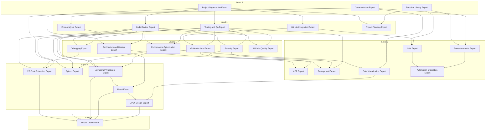

# Expert Dependency Map

## Overview
This document maps the dependencies between all 26 AI experts to determine the optimal migration order from Python to TypeScript.

## Dependency Levels

### Level 0: Core Foundation (No Dependencies)
These experts can be migrated first as they don't depend on others:

1. **Project Organization Expert** - Foundation for project structure
2. **Documentation Expert** - Standalone documentation generation
3. **Template Library Expert** - Provides templates to others

### Level 1: Basic Dependencies (Depend on Level 0)
These experts depend on core foundation experts:

4. **Code Review Expert** - Depends on: Project Organization
5. **Testing and QA Expert** - Depends on: Project Organization
6. **GitHub Integration Expert** - Depends on: Project Organization
7. **Error Analysis Expert** - Depends on: Documentation
8. **Project Planning Expert** - Depends on: Project Organization, Template Library

### Level 2: Intermediate Dependencies (Depend on Levels 0-1)
These experts build on basic functionality:

9. **GitHub Actions Expert** - Depends on: GitHub Integration, Testing and QA
10. **Architecture and Design Expert** - Depends on: Project Organization, Code Review
11. **Security Expert** - Depends on: Code Review, Testing and QA
12. **Performance Optimization Expert** - Depends on: Code Review, Testing and QA
13. **Debugging Expert** - Depends on: Error Analysis, Code Review
14. **AI Code Quality Expert** - Depends on: Code Review, Testing and QA

### Level 3: Advanced Dependencies (Depend on Levels 0-2)
These experts require multiple lower-level experts:

15. **N8N Expert** - Depends on: Template Library, GitHub Integration
16. **Power Automate Expert** - Depends on: Template Library, Documentation
17. **MCP Expert** - Depends on: Architecture and Design, Security
18. **Deployment Expert** - Depends on: GitHub Actions, Security, Testing and QA
19. **Data Visualization Expert** - Depends on: Performance Optimization, Documentation
20. **Automation Integration Expert** - Depends on: N8N Expert, Power Automate Expert

### Level 4: Specialized Dependencies (Depend on Levels 0-3)
These experts integrate multiple advanced capabilities:

21. **VS Code Extension Expert** - Depends on: Code Review, Debugging, Documentation
22. **Python Expert** - Depends on: Code Review, Testing and QA, Performance Optimization
23. **JavaScript/TypeScript Expert** - Depends on: Code Review, Testing and QA, Performance Optimization
24. **React Expert** - Depends on: JavaScript/TypeScript Expert, Architecture and Design
25. **UI/UX Design Expert** - Depends on: React Expert, Data Visualization

### Level 5: Orchestration (Depends on All)
26. **Master Orchestrator** - Depends on: All other experts

## Migration Order

Based on the dependency analysis, here's the recommended migration order:

### Phase 1: Core Foundation (Week 1)
1. Project Organization Expert ⭐ (Start Here)
2. Documentation Expert
3. Template Library Expert

### Phase 2: Basic Tools (Week 1-2)
4. Code Review Expert
5. Testing and QA Expert
6. GitHub Integration Expert
7. Error Analysis Expert
8. Project Planning Expert

### Phase 3: Intermediate Experts (Week 2-3)
9. GitHub Actions Expert
10. Architecture and Design Expert
11. Security Expert
12. Performance Optimization Expert
13. Debugging Expert
14. AI Code Quality Expert

### Phase 4: Advanced Integration (Week 3-4)
15. N8N Expert
16. Power Automate Expert
17. MCP Expert
18. Deployment Expert
19. Data Visualization Expert
20. Automation Integration Expert

### Phase 5: Specialized Experts (Week 4-5)
21. VS Code Extension Expert
22. Python Expert
23. JavaScript/TypeScript Expert
24. React Expert
25. UI/UX Design Expert

### Phase 6: Master Orchestration (Week 5-6)
26. Master Orchestrator

## Dependency Graph

## Key Insights

1. **Project Organization Expert** is the most fundamental expert with no dependencies
2. **Master Orchestrator** has the most dependencies (all 25 other experts)
3. **Code Review Expert** is a critical hub that many others depend on
4. **Template Library Expert** enables multiple automation experts
5. **JavaScript/TypeScript Expert** is crucial for React Expert, which enables UI/UX Design Expert

## Parallel Migration Opportunities

Within each phase, the following experts can be migrated in parallel:

- Phase 1: All three can be done in parallel
- Phase 2: Code Review + Testing and QA, GitHub Integration, Error Analysis can be parallel
- Phase 3: Multiple parallel tracks possible
- Phase 4: N8N and Power Automate can be parallel
- Phase 5: VS Code, Python, and JavaScript experts can be parallel